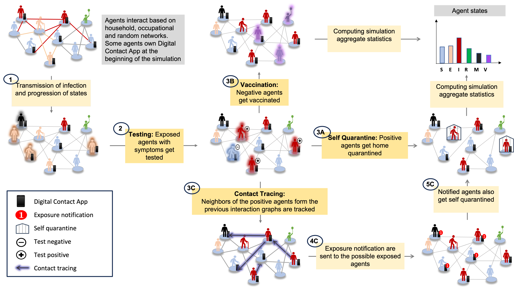

# First 100 days of pandemic; an interplay of pharmaceutical, behavioral and digital interventions – A study using agent based modeling
 

## Interventions Supported

- Pharmaceutical: Testing(specificity, speed), Two-dose Vaccination (delay days, efficacy)
- Behavioral: Self-Quarantine (days, break probability)
- Contact Tracing: Digital (adoption rate, compliance probability), Manual (compliance probability), Hybrid 2-Step

## Performance benchmarking
- 100,000 agents and 2 million interactions per second (to include graphic!)

### Implementation Reference
https://arxiv.org/pdf/2110.04421.pdf

## Citation
@misc{gupta2024100,
      title={First 100 days of pandemic; an interplay of pharmaceutical, behavioral and digital interventions -- A study using agent based modeling}, 
      author={Gauri Gupta and Ritvik Kapila and Ayush Chopra and Ramesh Raskar},
      year={2024},
      eprint={2401.04795},
      archivePrefix={arXiv},
      primaryClass={cs.MA}
}

## Contact
Please email: gaurii@mit.edu
